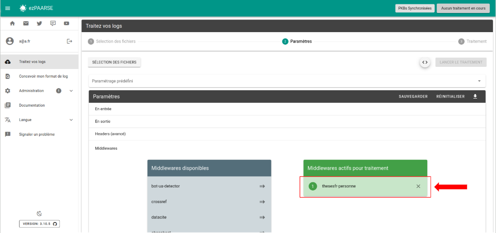

# thesesfr-personne

Fetches thesesfr-personne API from ABES.
This middleware is used only for log from these.fr. 

## Enriched fields

| Name | Type    | Description |
| --- |---------| --- |
| rtype | string  | type de consultation (ABS = notice de thèse vue ; PDF_THESIS = fichier de thèse téléchargé ; BIO = notice de personne vue ; ORGANISME = notice d'organisme vue) |
| nnt | string  | Numéro National de Thèse |
| numSujet | string  | identifiant de la thèse en préparation dans la base STEP |
| etabSoutenanceN | string  | nom de l'établissement de soutenance de la thèse |
| etabSoutenancePpn | string  | identifiant (PPN) de l'établissement de soutenance de la thèse |
| codeCourt | string  | code court de l'établissement de soutenance de la thèse |
| dateSoutenance | string  | date de soutenance de la thèse |
| anneeSoutenance | string  | année de soutenance de la thèse |
| dateInscription | string  | date d'inscription en doctorat |
| anneeInscription | string  | année d'inscription en doctorat |
| statut | string  | statut de la thèse : soutenue ou en préparation |
| discipline | string  | discipline de la thèse |
| ecoleDoctoraleN | string  | nom de l'école doctorale liée à la thèse |
| ecoleDoctoralePpn | string  | identifiant (PPN) de l'école doctorale liée à la thèse |
| partenaireRechercheN | string  | nom du partenaire de recherche (laboratoire, entreprise, équipe de recherche, fondation, etc) |
| partenaireRecherchePpn | string  | identifiant (PPN) du partenaire de recherche (laboratoire, entreprise, équipe de recherche, fondation, etc) |
| auteurN | string  | nom de l'auteur de la tèse |
| auteurPpn | string  | identifiant (PPN) de l'auteur de la thèse |
| directeurN | string  | nom du directeur de thèse |
| directeurPpn | string  | identifiant (PPN) du directeur de thèse |
| presidentN | string  | nom du président du jury |
| presidentPpn | string  | identifiant (PPN) du président du jury |
| rapporteursN | string  | nom des rapporteurs |
| rapporteursPpn | string  | identifiant (PPN) des rapporteurs |
| membresN | string  | nom des membres du jury |
| membresPpn | string  | identifiant (PPN) des membres du jury |
| personneN | string  | nom de la personne quel que soit son rôle (auteur, directeur, membre du jury, rapporteur, président du jury, etc) |
| personnePpn | string  | identifiant (PPN) de la personne quel que soit son rôle (auteur, directeur, membre du jury, rapporteur, président du jury, etc) |
| organismeN | string  | nom de l'organisme quel que soit son rôle (établissement de soutenance, école doctorale, partenaire de recherche, etc) |
| organismePpn | string  | identifiant (PPN) de l'organisme quel que soit son rôle (établissement de soutenance, école doctorale, partenaire de recherche, etc) |
| idp_etab_nom | string  | dans les logs Apache : nom de l'établissement de rattachement de l'utilisateur (quand connexion via Renater) |
| idp_etab_ppn | string  | dans les logs Apache : identifiant (PPN) de l'établissement de rattachement de l'utilisateur (quand connexion via Renater) |
| idp_etab_code_court | string  | dans les logs Apache : code court de l'établissement de rattachement de l'utilisateur (quand connexion via Renater) |
| platform_name | string  | nom long de la plateforme d'hébergement de la ressource : theses.fr |
| publication_title | string  | titre de la ressource |
| accessible | string  | thèse accessible en ligne : oui ou non |
| source | string  | source des données : STEP, STAR, Sudoc |
| domain | string  | domaine de la plateforme de la ressource (domaine apparaissant dans l'URL de la ressource) |
| langue | string  | langue de rédaction de la thèse |
| doiThese | string  | DOI attribué à la thèse |

## Prerequisites

Ec needs unitid and rtype equal to RECORD.

**You must use thesesfr-personne after filter, parser, deduplicator middleware.**

## Recommendation

This middleware should be used after thesesfr and before thesesfr-organisme.

## Headers

+ **thesesfr-personne-ttl** : Lifetime of cached documents, in seconds. Defaults to ``7 days (3600 * 24 * 7)``.
+ **thesesfr-personne-throttle** : Minimum time to wait between queries, in milliseconds. Defaults to ``200``ms.
+ **thesesfr-personne-base-wait-time** : Time to wait before retrying after a query fails, in milliseconds. Defaults to ``1000``ms. This time ``doubles`` after each attempt.
+ **thesesfr-personne-paquet-size** : Maximum number of identifiers to send for query in a single request. Defaults to ``50``.
+ **thesesfr-personne-buffer-size** : Maximum number of memorized access events before sending a request. Defaults to ``1000``.
+ **thesesfr-personne-max-attempts** : Maximum number of trials before passing the EC in error. Defaults to ``5``.
+ **thesesfr-personne-user-agent** : Specify what to send in the `User-Agent` header when querying thesesfr-personne. Defaults to `ezPAARSE (https://readmetrics.org; mailto:ezteam@couperin.org)`.

## How to use

### ezPAARSE admin interface

You can add or remove thesesfr-personne by default to all your enrichments, provided you have added an API key in the config. To do this, go to the middleware section of administration.


### ezPAARSE process interface

You can use thesesfr-personne for an enrichment process. You just add the middleware



### ezp

You can use thesesfr-personne for an enrichment process with [ezp](https://github.com/ezpaarse-project/node-ezpaarse) like this:

```bash
# enrich with one file
ezp process <path of your file> \
  --host <host of your ezPAARSE instance> \
  --settings <settings-id> \
  --header "ezPAARSE-Middlewares: thesesfr-personne" 
  --out ./result.csv

# enrich with multiples files
ezp bulk <path of your directory> \
  --host <host of your ezPAARSE instance> \
  --settings <settings-id> \
  --header "ezPAARSE-Middlewares: thesesfr-personne" 

```

### curl

You can use thesesfr-personne for an enrichment process with curl like this:

```bash
curl -X POST -v http://localhost:59599 \
  -H "ezPAARSE-Middlewares: thesesfr-personne" \
  -H "Log-Format-Ezproxy: <line format>" \
  -F "file=@<log file path>"

```